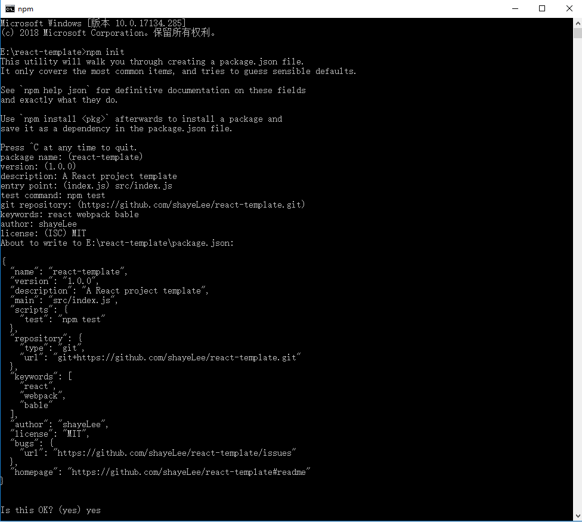
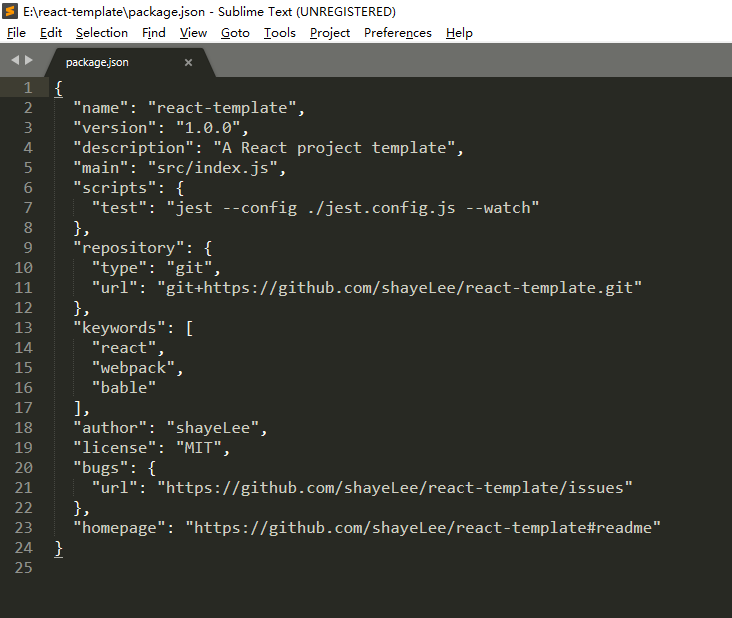
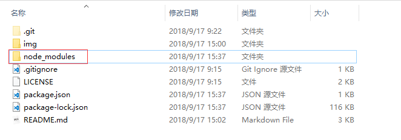

# 从零开始搭建一个React项目

如果你还不知道什么是`React`，请点击[这里](https://react.docschina.org/)

## 安装Node.js

如果你还不知道什么是`ECMAScript`，请点击[这里](https://baike.baidu.com/item/ECMAScript/1889420?fr=aladdin)

如果你还不知道什么是`Node.js`，请点击[这里](https://baike.baidu.com/item/node.js/7567977?fr=aladdin)

下载[Node.js](http://nodejs.cn/download/)并安装；接着打开`windows`命令行窗口分别输入`node -v`及`npm -v`
如下图所示，`node`和`npm`均显示出版本号则表示安装成功！


## npm初始化项目

如果你还不知道什么是`npm`，请点击[这里](https://docs.npmjs.com/getting-started/what-is-npm)

在你想要放置该项目代码的任何地方新建一个文件夹，并命名为`react-template`，接着打开该文件夹路径下`windows`命令行窗口输入`npm init`，接着根据提示依次输入：

- `package name`：项目名称（默认是文件夹名称）
- `version`：版本号（默认是1.0.0）
- `description`：项目描述
- `entry point`：项目入口文件（默认是index.js）
- `test command`：测试命令
- `git repository`：`git`远程仓库地址
- `keywords`：项目关键词
- `author`：作者
- `license`：开源许可声明



初始化完成后，项目根目录会自动生成`package.json`文件，这就是项目的`npm`配置文件了。



## 使用webpack4搭建自动化开发环境

如果你还不知道什么是`webpack`，请点击[这里](https://webpack.docschina.org/concepts/)，并且本人强烈建议把该页内容耐心读完。

### 一、使用npm安装webpack

首先，给`package.json`文件写入两个属性：


这两个属性都是用来维护项目的**本地依赖包**列表的，但是`devDependencies`比较特殊，它只是开发环境的依赖，当构建生产环境代码时，这些包的代码会被舍去。

接着，给`devDependencies`写入`webpack`的依赖：

键值对：`key`为包名，`value`为版本号

```json
{
    ...
    
    "devDependencies": {
        "webpack": "^4.12.0",
    	"webpack-cli": "^3.0.8"
    	...
    
    }
}
```

命令行`npm install`或`npm i`，这个命令会根据`dependencies`和`devDependencies`的配置去检查是否所有的依赖包都在本地安装了，若没有则会安装对应的包到本地。


如果你对`npm`命令行不了解，可以看[这里](http://www.cnblogs.com/PeunZhang/p/5553574.html#npm-install)

如果你对`npm`的“全局”和“本地”的概念不是很清楚，例如：上文提到的**本地依赖包**，可以看[这里](https://www.cnblogs.com/PeunZhang/p/5629329.html)

安装成功后，项目根目录下会生成一个`node_modules`文件夹，它就是本地依赖包的仓库，你可以在它的里面找到包`webpack`和`webpack-cli`。



### 二、编写webpack4配置文件

新建`react-template/src`文件夹，并在里面新建文件`index.js`

新建`react-template/build`文件夹，接着在`build`文件夹里再新建三个文件：

- `webpack.base.js`：基础配置文件（开发和生产共用）
- `webpack.dev.js`：自动化开发环境的配置文件
- `webpack.pro.js`：构建生产环境代码的配置文件

关于`webpack`配置的详细内容，请看[这里](https://webpack.docschina.org/configuration/)

一般来说`React`项目需要有如下代码所示的一些`webpack`基础配置

```javascript
var path = require('path');

module.exports = {
    // __dirname表示当前目录，path.resolve()可以将相对路径转为绝对路径
    
    //项目入口文件
    entry: path.resolve(__dirname, '../src/index.js'),
    
    output: {
        // 打包后的文件的生成位置（E:/react-template/dist/）
        path: path.resolve(__dirname, "../dist/"),
        // 主js文件（E:/react-template/dist/js/main.js）
        filename: "js/main.js",
        // 按需加载的文件（按需加载的模块会被拆分成单独的文件，name即为模块名称）
        chunkFilename: "js/[name].js",
        // publicPath + chunkFilename 为打包后生成的html文件请求按需加载文件的路径
        // publicPath + 图片的URL 为打包后生成的html文件请求图片的路径，其他静态资源文件同理
		publicPath: "/"
	},
}
```


