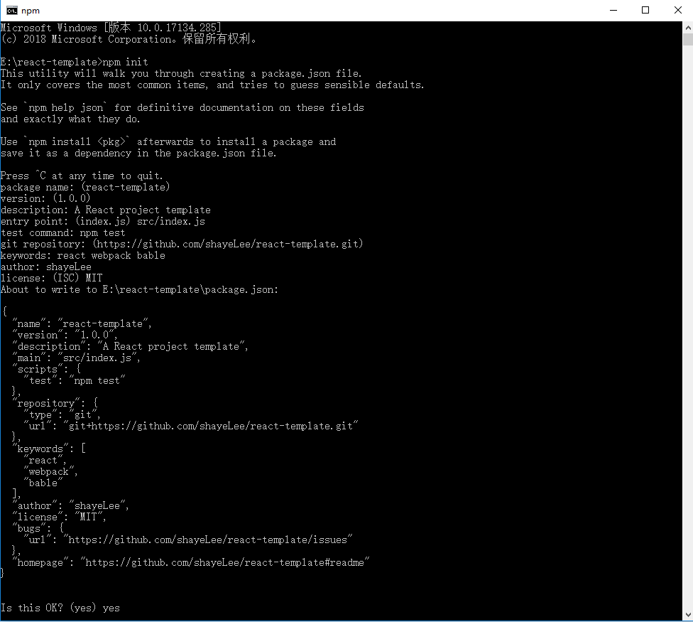
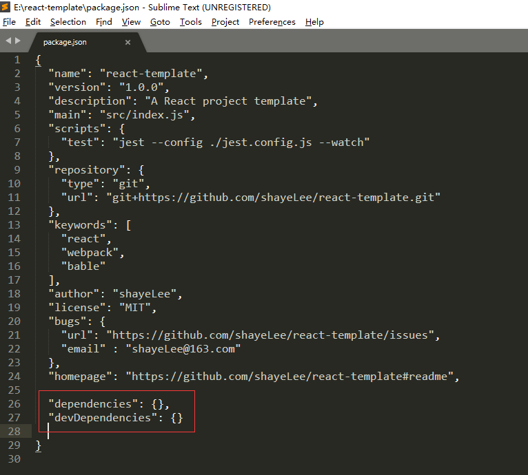
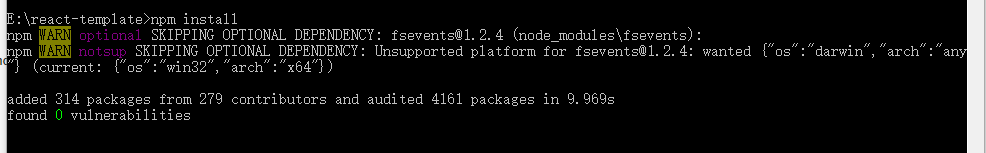
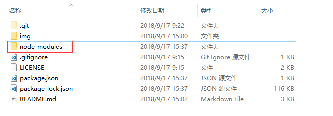
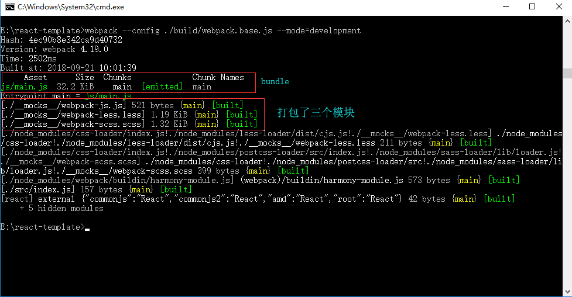
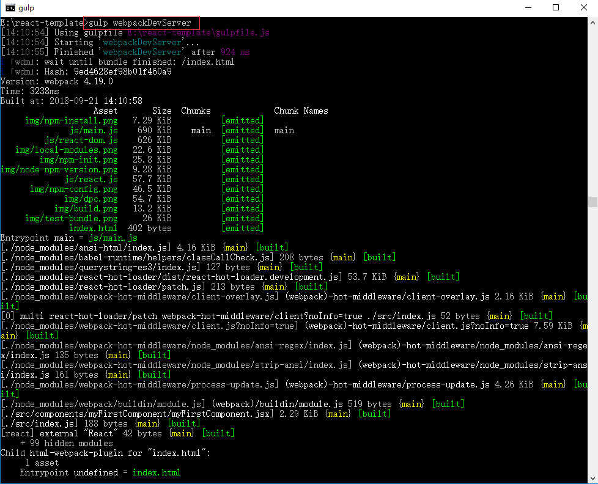
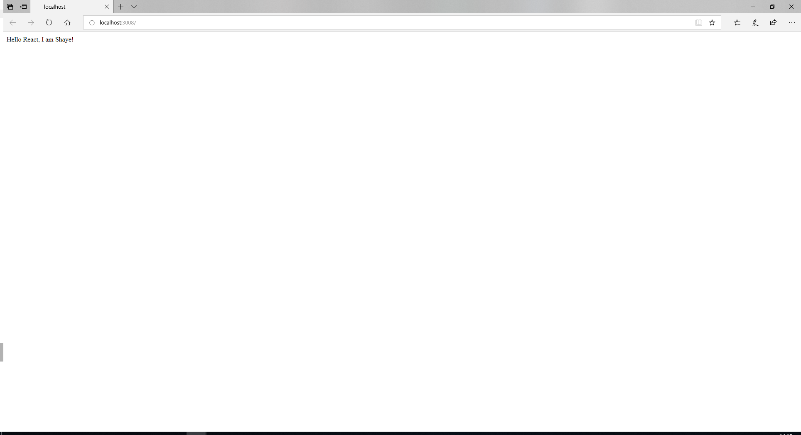

# 从零开始搭建一个React项目

如果你还不知道什么是`React`，请点击[这里](https://react.docschina.org/)

## 安装Node.js

如果你还不知道什么是`ECMAScript`，请点击[这里](https://baike.baidu.com/item/ECMAScript/1889420?fr=aladdin)

如果你还不知道什么是`Node.js`，请点击[这里](https://baike.baidu.com/item/node.js/7567977?fr=aladdin)

下载[Node.js](http://nodejs.cn/download/)并安装；接着打开`windows`命令行窗口分别输入`node -v`及`npm -v`
如下图所示，`node`和`npm`均显示出版本号则表示安装成功！


## npm初始化项目

如果你还不知道什么是`npm`，请点击[这里](https://docs.npmjs.com/getting-started/what-is-npm)

在你想要放置该项目代码的任何地方新建一个文件夹，并命名为`react-template`，接着打开该文件夹路径下`windows`命令行窗口输入`npm init`，接着根据提示依次输入：

- `package name`：项目名称（默认是文件夹名称）
- `version`：版本号（默认是1.0.0）
- `description`：项目描述
- `entry point`：项目入口文件（默认是index.js）
- `test command`：测试命令
- `git repository`：`git`远程仓库地址
- `keywords`：项目关键词
- `author`：作者
- `license`：开源许可声明



初始化完成后，项目根目录会自动生成`package.json`文件，这就是项目的`npm`配置文件了。


## 使用webpack4搭建自动化开发环境

如果你还不知道什么是`webpack`，请点击[这里](https://webpack.docschina.org/concepts/)，并且本人强烈建议把该页内容耐心读完。

`webpack`是一个静态资源模块打包器，并且`webpack`支持多种不同的模块系统，我们主要用到以下三个：

- [es6模块系统](https://developer.mozilla.org/zh-CN/docs/Web/JavaScript/Reference/Statements/import)
- [node平台的CommonJS模块系统](http://www.commonjs.org/specs/modules/1.0/)
- sass/less的模块系统

### 一、使用npm安装webpack

首先，给`package.json`文件写入两个属性：



这两个属性都是用来维护项目的**本地依赖包**列表的，但是`devDependencies`比较特殊，它只是开发环境的依赖，当构建生产环境代码时，这些包的代码会被舍去。

接着，给`devDependencies`写入`webpack`的依赖：

键值对：`key`为包名，`value`为版本号

```json
{
    ...
    
    "devDependencies": {
        "webpack": "^4.12.0",
    	"webpack-cli": "^3.0.8"
    	...
    
    }
}
```

命令行`npm install`或`npm i`，这个命令会根据`dependencies`和`devDependencies`的配置去检查是否所有的依赖包都在本地安装了，若没有则会安装对应的包到本地。



如果你对`npm`命令行不了解，可以看[这里](http://www.cnblogs.com/PeunZhang/p/5553574.html#npm-install)

如果你对`npm`的“全局”和“本地”的概念不是很清楚，例如：上文提到的**本地依赖包**，可以看[这里](https://www.cnblogs.com/PeunZhang/p/5629329.html)

安装成功后，项目根目录下会生成一个`node_modules`文件夹，它就是本地依赖包的仓库，你可以在它的里面找到包`webpack`和`webpack-cli`。



特别地，还需要全局安装`webpack`，否则命令行窗口认不到 webpack 的命令。

```
$ npm i -g webpack webpack-cli
```

### 二、编写webpack4配置文件

新建`react-template/src`文件夹，并在里面新建文件`index.js`

新建`react-template/build`文件夹，接着在`build`文件夹里再新建两个文件：

- `webpack.base.js`：基础配置文件（开发和生产共用）
- `webpack.dev.js`：自动化开发环境的配置文件
- `webpack.pro.js`：构建生产环境代码配置文件

关于`webpack`配置的详细内容，请看[这里](https://webpack.docschina.org/configuration/)

#### webpack基础配置

配置文件通常是一个`CommonJS`规范的模块，输出一个`JavaScript Object`

##### entry

```javascript
// __dirname表示当前目录，path.resolve()可以防止不同操作系统之间的文件路径问题，并且可以使相对路径按照预期工作
module.exports = {
    /**
     * 项目入口文件
    */
    entry: path.resolve(__dirname, '../src/index.js')
    // ...省略其它选项
}
```

##### output

```javascript
module.exports = {
    //...
    
    /**
     * 指定打包后的 bundle 如何输出
     * 特别说明：
     * 1. bundle是指多个模块打包在一起，产生的新文件。bundle 一般由html文件通过 script 标签加载
    */
    output: {
        // 打包后的 bundle 的生成位置（E:/react-template/dist/）
        path: path.resolve(__dirname, "../dist/"),

        // 主 bundle（E:/react-template/dist/js/main.js）
        filename: "js/main.js",

        // chunk: 单独拆分出来的 bundle，name即为chunk的名称
        chunkFilename: "js/[name].js",

        // publicPath + chunkFilename 为打包后生成的html文件请求 chunkFile 的路径
        // publicPath + 图片的URL 为打包后生成的html文件请求图片的路径，其他静态资源文件同理
        publicPath: "/"
	}
    
    //...
}
```

##### resolve

```javascript
module.exports = {
    //...
    
    /**
     * 如何解析模块路径
    */
    resolve: {
        // 指定要解析的文件扩展名
        extensions: [".web.js", ".jsx", ".js", ".json"],

        // 模块路径别名
        alias: {}
    },
    
    //...
}
```

##### module

```javascript
module.exports = {
    //...
    
    /**
     * 指定如何处理（编译）各种类型的模块
     * 特别说明：
     * 1. webpack提供了丰富的针对不同类型模块的loader，你可以使用loader对模块进行预处理或者对模块的      *    源代码进行转换（编译）
     * 2. 常见的模块类型：js, jsx, css, scss, less, json, png, git, jpg
    */
    module: {
        /**
         * 各种类型模块的处理规则
         * 特别说明：
         * 1. use属性表示模块使用什么loader
         * 2. 模块可以使用多个loader，处理顺序为use属性的数组的第一个到最后一个
        */
        rules: [
            // 图片文件小于8192byte时，转换为base64字符串
            {
                test: /\.(gif|png|jpg|jpeg|woff|woff2|eot|ttf|svg)(\?t=\d+)?$/,
                exclude: /node_modules/,
                use: ["url-loader?limit=8192"]
            },
            
            /**
             * 将js和jsx模块的源代码编译成浏览器能正常执行的代码
             * 特别说明：
             * 1. eslint是一个代码检查工具，中文官网：https://cn.eslint.org/
             *	  一般我们会在项目根目录下为eslint创建一个配置文件 .eslintrc.json ，关于eslint			   *	的配置，祥见：附录/eslint-loader配置文件
             * 2. babel是一个JavaScript编译器，它能够将浏览器尚未实现的新一代的ES语法转换成浏览器              *    已实现的语法，比如我们现在广泛使用的es6和部分es7语法和新的内置对象，其实浏览器并没              *    有完全实现，但是有了babel，我们完全可以放心使用它们。
             * 3. 一般我们会在项目根目录下为babel创建一个配置文件 .babelrc ，关于babel的配置，详				 *    见：附录/babel-loader配置文件
            */
            {
                enforce: "pre",
                test: /\.(js|jsx)?$/,
                exclude: /node_modules/,
                use: [{
                    loader: 'eslint-loader',
                    options: {
                        emitError: true,
                        emitWarning: true,
                        failOnError: true
                    }
                }]
            },
            {
                test: /\.(js|jsx)?$/,
                exclude: /node_modules/,
                use: ["babel-loader"]
            },
            
            /**
             * 处理css模块 
             * loader说明：
             * 1. style-loader 将css文件以
             *	  <link rel="stylesheet" href="path/to/file.css">
             *	  的形式插入到html文件
             * 2. css-loader 处理css的 @import语句 与 url() ，同时压缩代码
             * 3. postcss-loader 对css做一些加工处理，具体的配置放在postcss.config.js，比如给			  *    css自动添加浏览器厂商前缀。如果不知道css浏览器厂商前缀的，请自行百度。
            */
            {
                test: /\.(css)?$/,
                use: [
                    "style-loader/url",
                    {
                        loader: "css-loader",
                        options: {
                            minimize: {
                                safe: true,
                                discardComments: {
                                    removeAll: true
                                }
                            }
                        }
                	},
                    "postcss-loader"
                ]
            },
            
            /**
             * 处理less模块
             * 特别说明：
             * 1. Less 是一门 CSS 预处理语言，它扩展了 CSS 语言，增加了变量、Mixin、函数等特性，				 *	  使 CSS 更易维护和扩展。
             * 2. Less中文网：http://lesscss.cn/
            */
            {
                test: /\.less$/,
                use: ["style-loader", "css-loader", "less-loader"]
            },
            
            /**
             * 处理scss模块
             * 特别说明：
             * 1. sass与less类似，也是一门css预处理语言。
            */
            {
                test: /\.scss$/,
                exclude: /node_modules/,
                use: [
                    'style-loader',
                    'css-loader',
                    'postcss-loader',
                    'sass-loader'
                ]
            }
        ]
    }
    
    //...
}
```

##### externals

```javascript
module.exports = {
    //...
    
    /**
     * 外部扩展
     * 有时候你可能不想把某个第三方 library 打包进你的 package 里，而是希望 library 做为外部依赖；	   * 比如通过 script 标签来加载此 library ， externals 这个选项可以帮到你。
    */
    externals: {
        "react": {
            commonjs: 'React',
	        commonjs2: 'React',
     	    amd: 'React',
       		root: 'React'
        },
        "react-dom": {
            commonjs: 'ReactDOM',
	        commonjs2: 'ReactDOM',
     	    amd: 'ReactDOM',
       		root: 'ReactDOM'
        }
    }
    
    //...
}
```

##### optimization

```javascript
module.exports = {
    //...
    
    /**
     * 优化
    */
    optimization: {
        /**
         * 代码拆分
         * 从入口文件开始，webpack 递归地构建了整个应用的模块依赖图表（dependency graph），然后通		   * 常会将所有的模块打包成一个 bundle。但是有两种情况需要把一些模块拆分成单独的 bundle：
         * 1. 通过 import() 函数导入的模块，这些模块不会被打包进主 bundle 里，而是拆分为单独的   		   * 	bundle，等待 import() 函数执行，再去异步加载。
         * 	  import() 函数介绍：https://juejin.im/entry/58ba3308a22b9d005ede7565
         * 2. 有的模块由于被多个不同的 bundle 依赖，所以这几个 bundle 里都会有该模块的代码；这时就		 * 	  需要将这种模块也单独拆分出来，避免重复加载相同的模块。
        */
        splitChunks: {
			chunks: "all",
			minSize: 30000,
			minChunks: 2,
			maxAsyncRequests: 5,
			maxInitialRequests: 3,
			automaticNameDelimiter: "~",
			name: true,
			cacheGroups: {
				default: false,
				vendor: {
					name: "vendor",
					priority: 99
				}
			}
		}
    }
}
```

以上就是`webpack`的基础配置了。我们还需要把配置中用到的`loader`及相关的模块下载到本地。

其中，由于：

`babel-loader`依赖以下列出的`package`:

- [babel-core](https://www.npmjs.com/package/babel-core)
- [babel-runtime](https://babeljs.io/docs/en/next/babel-runtime.html)
- [babel-plugin-transform-runtime](https://www.npmjs.com/package/babel-plugin-transform-runtime)
- [babel-plugin-external-helpers](https://www.npmjs.com/package/babel-plugin-external-helpers)
- [babel-preset-env](https://www.npmjs.com/package/babel-preset-env)
- [babel-preset-react](https://www.npmjs.com/package/babel-preset-react)
- [babel-plugin-import](https://www.npmjs.com/package/babel-plugin-import)
- [babel-plugin-syntax-dynamic-import](https://www.npmjs.com/package/babel-plugin-syntax-dynamic-import)
- [babel-plugin-transform-class-properties](https://www.npmjs.com/package/babel-plugin-transform-class-properties)
- [babel-plugin-transform-decorators-legacy](https://www.npmjs.com/package/babel-plugin-transform-decorators-legacy)

`eslint-loader`依赖以下列出的`package`:

- [eslint](https://www.npmjs.com/package/eslint)
- [babel-eslint](https://www.npmjs.com/package/babel-eslint)
- [eslint-plugin-react](https://www.npmjs.com/package/eslint-plugin-react)

`less-loader`依赖 [less](https://www.npmjs.com/package/less)

`postcss-loader`依赖 [postcss](https://www.npmjs.com/package/postcss)

把上面列出的`package`写入`package.json`的`dependencies`和`devDependencies`

```json
{
    "dependencies": {
        "babel-runtime": "^6.26.0"
    },
    "devDependencies": {
        "autoprefixer": "^9.1.5",
        "babel-core": "^6.26.3",
        "babel-eslint": "^9.0.0",
        "babel-loader": "^7.1.5",
        "babel-plugin-external-helpers": "^6.22.0",
        "babel-plugin-import": "^1.9.1",
        "babel-plugin-syntax-dynamic-import": "^6.18.0",
        "babel-plugin-transform-class-properties": "^6.24.1",
        "babel-plugin-transform-decorators-legacy": "^1.3.5",
        "babel-plugin-transform-runtime": "^6.23.0",
        "babel-preset-env": "^1.7.0",
        "babel-preset-react": "^6.24.1",
        "css-loader": "^1.0.0",
        "eslint": "^5.6.0",
        "eslint-loader": "^2.1.1",
        "eslint-plugin-react": "^7.11.1",
        "file-loader": "^2.0.0",
        "less": "^3.8.1",
        "less-loader": "^4.1.0",
        "node-sass": "^4.9.0",
        "path": "^0.12.7",
        "postcss": "^6.0.22",
        "postcss-loader": "^3.0.0",
        "react-hot-loader": "^4.3.8",
        "sass-loader": "^7.0.3",
        "style-loader": "^0.23.0",
        "url-loader": "^1.1.1",
        "webpack": "^4.12.0",
        "webpack-cli": "^3.1.0",
        "webpack-merge": "^4.1.4"
    }
}
```

接着

```
$ npm install
```

#### webpack自动化开发环境配置

上一步的基础配置都完成之后，实际上`webpack`已经可以正常工作了，你可以写一些测试模块，然后在`src/index.js`引入，用命令行运行`webpack`

```
$ webpack --config ./build/webpack.base.js --mode=development
```



但是这个过程是纯手动的，我们可以使用一些`webpack plugin`来让某些动作自动化，以此来提高工作效率。

下面是`webpack`开发模式的配置文件：

```javascript
var base = require("./webpack.base.js"),
    // merge() 合并配置选项
    merge = require('webpack-merge'),
    HtmlWebpackPlugin = require("html-webpack-plugin"),
    copyWebpackPlugin = require("copy-webpack-plugin");

module.exports = merge(base, {
    // 开发模式
    mode: "development",
    
    devtool: "#cheap-module-eval-source-map",
    
    // webpack plugin -> https://webpack.docschina.org/plugins/
    plugins: [
        // 复制无需参与构建的文件到输出位置
        new copyWebpackPlugin([
            {
                from: "src/js_modules/react/dev/react.js",
                to: "js/"
            },
            {
                from: "src/js_modules/react-dom/dev/react-dom.js",
                to: "js/"
            },
            {
                from: "img/**/*.*",
                to: ""
            }
        ]),
        
        // 自动在输出位置创建html文件，并在html文件自动注入加载bundle的script标签或link标签
        new HtmlWebpackPlugin({
            filename: "index.html",
            template: "index.html",
            chunks: ["main", "vendor"],
            inject: true,
            chunksSortMode: "auto"
        })
    ]
});
```

光是能复制或自动创建文件还不够，我们希望在开发过程中，当我们修改代码之后，webpack能够监听变更的文件自动增量编译，也希望浏览器能实时响应我们的代码（文件）变更，并自动变化或重载。要实现这个需求，我们需要使用`express`，并结合`webpack-dev-middleware`和`webpack-hot-middleware`来搭建一个开发服务器。顺便提一句我个人比较推荐使用[gulp](https://www.gulpjs.com.cn/)来作为项目工程化的流程管理工具，所以启动开发服务器我是作为一个 gulp任务 来编写的，首先在根目录创建一个`gulpfile.js`，写入下面的代码：

```javascript
var gulp = require("gulp"),
    gutil = require("gulp-util"),
    express = require("express"),
    webpack = require("webpack"),
    webpackDevMiddleware = require("webpack-dev-middleware"),
    webpackHotMiddleware = require("webpack-hot-middleware"),
    history = require("connect-history-api-fallback"),
    opn = require("opn");

// 开发服务器
gulp.task("dev", function() {
    var webpackDevConfig = require("./build/webpack.dev.js");

    webpackDevConfig.entry = [
        "webpack-hot-middleware/client?noInfo=true"
    ].concat([webpackDevConfig.entry]);

    webpackDevConfig.plugins = webpackDevConfig.plugins.concat([
        new webpack.HotModuleReplacementPlugin()
    ]);

    var devCompiler = webpack(webpackDevConfig);
    var devMiddleware = webpackDevMiddleware(devCompiler, {
        publicPath: webpackDevConfig.output.publicPath,
        stats: {
            chunks: false,
            colors: true,
            timings: true,
            source: true,
            cachedAssets: false
        },
        watchOptions: {
            ignored: /node_modules/,
            aggregateTimeout: 300,
            poll: true
        }
    });
    var hotMiddleware = webpackHotMiddleware(devCompiler, {
        log: false
    });

    var server = express();
    server.use(history());
    server.use(devMiddleware);
    server.use(hotMiddleware);
    server.listen(3008, function(err) {
        if (err) throw new gutil.PluginError("webpack-dev-server", err);
        opn("http://localhost:3008")
    });
});
```

把以上相关的`package`写入`package.json`并`npm install`

```json
{
    "dependencies": {
        "babel-runtime": "^6.26.0",
        "react": "^16.4.1"
    },
    "devDependencies": {
        "autoprefixer": "^9.1.5",
        "babel-core": "^6.26.3",
        "babel-eslint": "^9.0.0",
        "babel-loader": "^7.1.5",
        "babel-plugin-external-helpers": "^6.22.0",
        "babel-plugin-import": "^1.9.1",
        "babel-plugin-syntax-dynamic-import": "^6.18.0",
        "babel-plugin-transform-class-properties": "^6.24.1",
        "babel-plugin-transform-decorators-legacy": "^1.3.5",
        "babel-plugin-transform-runtime": "^6.23.0",
        "babel-preset-env": "^1.7.0",
        "babel-preset-react": "^6.24.1",
        "connect-history-api-fallback": "^1.5.0",
        "copy-webpack-plugin": "^4.5.2",
        "css-loader": "^1.0.0",
        "eslint": "^5.6.0",
        "eslint-loader": "^2.1.1",
        "eslint-plugin-react": "^7.11.1",
        "express": "^4.16.3",
        "file-loader": "^2.0.0",
        "gulp": "^3.9.1",
        "gulp-sequence": "^1.0.0",
        "gulp-util": "^3.0.8",
        "html-webpack-plugin": "^3.2.0",
        "http-proxy-middleware": "^0.18.0",
        "less": "^3.8.1",
        "less-loader": "^4.1.0",
        "node-sass": "^4.9.0",
        "opn": "^5.3.0",
        "path": "^0.12.7",
        "postcss": "^6.0.22",
        "postcss-loader": "^3.0.0",
        "react-hot-loader": "^4.3.4",
        "sass-loader": "^7.0.3",
        "style-loader": "^0.23.0",
        "url-loader": "^1.1.1",
        "webpack": "^4.12.0",
        "webpack-cli": "^3.1.0",
        "webpack-dev-middleware": "^3.1.3",
        "webpack-hot-middleware": "^2.22.3",
        "webpack-merge": "^4.1.4"
    }
}
```

然后在根目录创建`index.html`，内容如下：

```html
<!doctype html>
<html>

<head>
    <meta charset="utf-8">
    <meta name="viewport" content="width=device-width, initial-scale=1, maximum-scale=1, minimum-scale=1, user-scalable=no" />
</head>

<body>
    <div id="app"></div>
    <script src="./js/react.js"></script>
    <script src="./js/react-dom.js"></script>
</body>

</html>
```

接着，编写一个`react`组件

```jsx
// 文件路径：react-template/src/components/myFirstComponent/myFirstComponent.jsx

import { hot } from "react-hot-loader";

// @hot 可以是react组件热重载
@hot(module)
class MyFirstComponent extends React.Component {
  state = {
    text: "Hello React"
  };

  /** 组件生命周期钩子函数：在组件挂载完成后立即被调用 */
  componentDidMount() {
    console.log("组件挂载完成！");
  }

  render() {
    return (
      <div>{this.state.text}, I am {this.props.author}!</div>
    )
  }
}

export default MyFirstComponent;
```

```javascript
// 文件路径：react-template/src/index.js
import MyFirstComponent from "./components/myFirstComponent/myFirstComponent"

ReactDOM.render(<MyFirstComponent author="Shaye"></MyFirstComponent>, document.getElementById("app"));
```

最后，打开`CMD`：

```
$ gulp dev
```

废话少说，直接上图：



浏览器会自动打开：



**你还可以试着修改组件的内容，你会发现每当你按下保存键，浏览器会跟着实时变化**

好了，前面折腾了这么久，现在你可以去开发你的react应用了。只不过嘛，现在你能自由地开发调试了，但是还不能构建产品包，所以接下来我们还需要再配置一下 如何构建生产环境的代码。

#### webpack构建生产环境代码配置

`webpack.pro.js`配置文件

```javascript
var base = require('./webpack.base.js'),
    merge = require('webpack-merge'),
    HtmlWebpackPlugin = require('html-webpack-plugin'),
    BundleAnalyzerPlugin = require('webpack-bundle-analyzer').BundleAnalyzerPlugin,
    WebpackMd5Hash = require('webpack-md5-hash');

module.exports = merge(base, {
    mode: 'production',
    plugins: [
        new WebpackMd5Hash(),
        new BundleAnalyzerPlugin(),
        new HtmlWebpackPlugin({
            filename: 'index.html',
            template: 'index.html',
            chunks: ['main', 'vendor'],
            inject: true,
            chunksSortMode: 'auto',
            minify: {
                removeComments: true,
                collapseWhitespace: true,
                removeAttributeQuotes: true
            }
        })
    ]
});
```

编写`gulp`构建生产环境代码任务：

```javascript
var gulp = require("gulp"),
    gulpSequence = require("gulp-sequence"),
    gutil = require("gulp-util"),
    del = require("del"),
    uglify = require("gulp-uglify"),
    imagemin = require("gulp-imagemin"),
    express = require("express"),
    webpack = require("webpack"),
    webpackDevMiddleware = require("webpack-dev-middleware"),
    webpackHotMiddleware = require("webpack-hot-middleware"),
    history = require("connect-history-api-fallback"),
    opn = require("opn");

//...省略其他任务

//清除
gulp.task("clean", function(cb) {
    del.sync("dist");
    cb();
});

//图片压缩
gulp.task("copyImg", function() {
    return gulp
        .src("img/**/*.*")
        .pipe(imagemin())
        .pipe(gulp.dest("dist/img/"));
});

//复制无需编译的js文件
gulp.task("copyJs", function() {
    return gulp
        .src([
        "src/js_modules/react/pro/react.js",
        "src/js_modules/react-dom/pro/react-dom.js"
    ])
        .pipe(uglify())
        .pipe(gulp.dest("dist/js/"));
});

//webpack production
gulp.task("webpackPro", function(cb) {
    var webpackProConfig = require("./build/webpack.pro.js");
    webpack(webpackProConfig, function(err, stats) {
        if (err) throw new gutil.PluginError("webpack:production", err);
        gutil.log(
            "[webpack:production]",
            stats.toString({
                chunks: false,
                colors: true,
                timings: true,
                source: true,
                cachedAssets: false
            })
        );
        cb();
    });
});

gulp.task("buildSuccess", function(cb) {
    gutil.log("[webpack:production]", "build success!");
    cb();
});

gulp.task(
    "build",
    gulpSequence("clean", "copyImg", "copyJs", "webpackPro", "buildSuccess")
);
```

最后，老规矩把相关的`package`写入`package.json`并`npm install`

```json
"dependencies": {
    "babel-runtime": "^6.26.0",
    "react": "^16.4.1"
},
"devDependencies": {
    "autoprefixer": "^9.1.5",
    "babel-core": "^6.26.3",
    "babel-eslint": "^9.0.0",
    "babel-loader": "^7.1.5",
    "babel-plugin-external-helpers": "^6.22.0",
    "babel-plugin-import": "^1.9.1",
    "babel-plugin-syntax-dynamic-import": "^6.18.0",
    "babel-plugin-transform-class-properties": "^6.24.1",
    "babel-plugin-transform-decorators-legacy": "^1.3.5",
    "babel-plugin-transform-runtime": "^6.23.0",
    "babel-preset-env": "^1.7.0",
    "babel-preset-react": "^6.24.1",
    "connect-history-api-fallback": "^1.5.0",
    "copy-webpack-plugin": "^4.5.2",
    "css-loader": "^1.0.0",
    "eslint": "^5.6.0",
    "eslint-loader": "^2.1.1",
    "eslint-plugin-react": "^7.11.1",
    "express": "^4.16.3",
    "file-loader": "^2.0.0",
    "gulp": "^3.9.1",
    "gulp-sequence": "^1.0.0",
    "gulp-util": "^3.0.8",
    "html-webpack-plugin": "^3.2.0",
    "http-proxy-middleware": "^0.18.0",
    "less": "^3.8.1",
    "less-loader": "^4.1.0",
    "node-sass": "^4.9.0",
    "opn": "^5.3.0",
    "path": "^0.12.7",
    "postcss": "^6.0.22",
    "postcss-loader": "^3.0.0",
    "react-hot-loader": "^4.3.4",
    "sass-loader": "^7.0.3",
    "style-loader": "^0.23.0",
    "url-loader": "^1.1.1",
    "webpack": "^4.12.0",
    "webpack-cli": "^3.1.0",
    "webpack-dev-middleware": "^3.1.3",
    "webpack-hot-middleware": "^2.22.3",
    "webpack-merge": "^4.1.4"
}
```

最后的最后，命令行输入`gulp build`试试效果吧!

## 附录

### babel-loader配置文件

```
{
    "presets": [
        [
            "env",
            {
                "modules": false,
                "targets": {
                    "browsers": ["last 5 versions", "IE 9"]
                }
            }
        ],
        "react"
    ],
    "plugins": [
        [
            "transform-runtime",
            {
                "polyfill": false,
                "regenerator": true
            }
        ],
        "external-helpers",
        "syntax-dynamic-import",
        "transform-class-properties",
        "transform-decorators-legacy",
        [
            "import",
            {
                "libraryName": "antd",
                "libraryDirectory": "es",
                "style": "css"
            }
        ],
        "react-hot-loader/babel"
    ],
    "env": {
        "test": {
            "presets": [
                [
                    "env",
                    {
                        "modules": false,
                        "targets": {
                            "browsers": [
                                "last 5 versions",
                                "IE 9"
                            ]
                        }
                    }
                ],
                "react"
            ],
            "plugins": [
                [
                    "transform-runtime",
                    {
                        "polyfill": false,
                        "regenerator": true
                    }
                ],
                "external-helpers",
                "syntax-dynamic-import",
                "transform-es2015-modules-commonjs",
                "transform-class-properties",
                "transform-decorators-legacy",
                [
                    "import",
                    {
                        "libraryName": "antd",
                        "libraryDirectory": "es",
                        "style": "css"
                    }
                ]
            ]
        }
    }
}
```

### eslint-loader配置文件

```json
{
    "root": true,
    "env": {
        "es6": true,
        "browser": true,
        "node": true
    },
    "parser": "babel-eslint",
    "parserOptions": {
        "sourceType": "module",
        "ecmaFeatures": {
            "jsx": true,
            "experimentalObjectRestSpread": true
        }
    },
    "globals": {
        "ReactDOM": false,
        "React": false,
        "jest": false,
        "test": false,
        "expect": false,
        "describe": false,
        "it": false
    },
    "plugins": ["react"],
    "extends": ["eslint:recommended", "plugin:react/recommended"],
    "settings": {
        "react": {
            "version": "16.4.1"
        }
    },
    "rules": {
        "no-extra-semi": 0,
        "no-console": 0,
        "react/prop-types": 0,
        "no-extra-boolean-cast": 0,
        "no-else-return": [1, { "allowElseIf": false }],
        "no-loop-func": 1,
        "arrow-spacing": 1,
        "eqeqeq": 2,
        "no-restricted-properties": [
            2,
            {
                "object": "disallowedObjectName",
                "property": "disallowedPropertyName"
            },
            {
                "object": "disallowedObjectName",
                "property": "anotherDisallowedPropertyName",
                "message": "Please use allowedObjectName.allowedPropertyName."
            }
        ],
        "no-return-assign": [2, "always"],
        "no-sequences": 2,
        "no-throw-literal": 2,
        "no-unmodified-loop-condition": 2,
        "no-useless-return": 2,
        "prefer-promise-reject-errors": [2, {"allowEmptyReject": true}],
        "require-await": 2,
        "jsx-quotes": [2, "prefer-double"],
        "prefer-const": 2
    }
}
```

### postcss-loader配置文件

```javascript
module.exports = {
    plugins:[
        require('autoprefixer')({
            browsers:[
                "last 3 versions","iOS 7","not ie <= 9",
                "Android >= 4.0",
                "last 3 and_chr versions",
                "last 3 and_ff versions",
                "last 3 op_mob versions",
                "last 3 op_mob versions",
                "last 3 op_mini versions"
            ],
            //是否美化属性值
            cascade:true,
            //是否去掉不必要的前缀
            remove:true
        })
    ]
};
```

